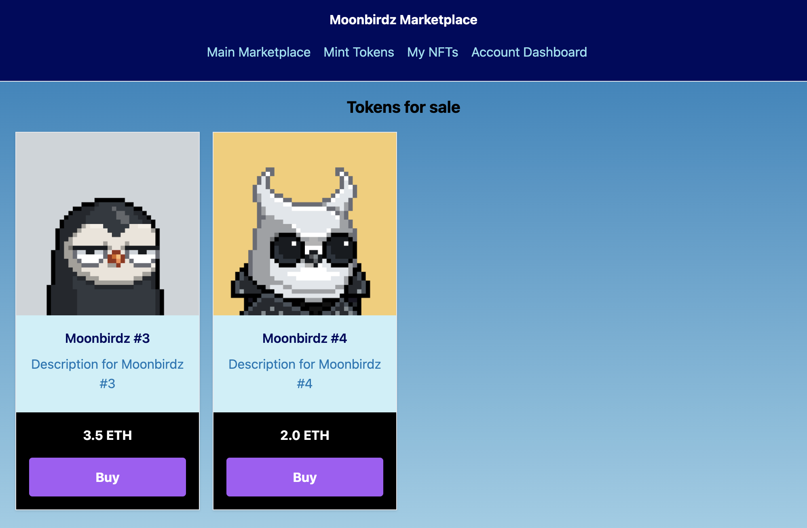
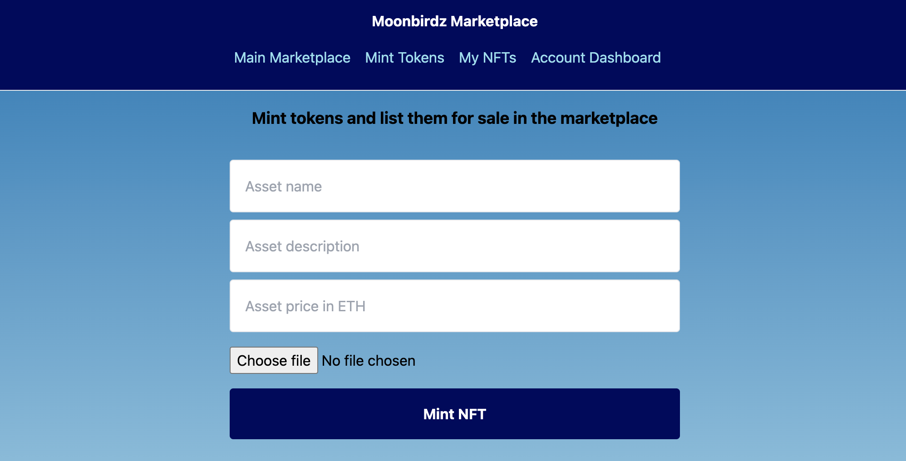

# Moonbirdz NFT Marketplace

A [Next.js](https://nextjs.org/) marketplace app that uses the Web3 and IPFS APIs of Infura to **mint**, **buy** and **sell** NFTs.





## Getting Started

### Prerequisites

You will need an [Infura](https://infura.io/) account with the following product keys:

* Web3 API
* IPFS

---

### Define Environment Variables

Make a copy of the example environment variables file and name it `.env.local`

```bash
cp .env.example .env.local
```

Populate the environment variables with the values shown in your Infura account.

---

### Deploy the Smart Contracts Locally

Install dependencies with:

```bash
yarn install
```

Start a local Hardhat node with:

```bash
yarn start:hardhat
```

Deploy the 2 smart contracts to the local node with:

```bash
yarn deploy:hardhat
```

> This command will also write the contract addresses to a file at `./config.js` where they can be consumed by the app.

---

### Running the Next.js web app

Start the development server:

```bash
yarn dev
```

Open [http://localhost:3000](http://localhost:3000) with your browser to see the marketplace app.

### Smart Contracts

This app uses 2 smart contracts:

- `MBMarket.sol` - fetching NFTs, keeping track of sold/unsold NFTs, creating sales (buying transactions)
- `NFT.sol` - for storing URIs and minting tokens
